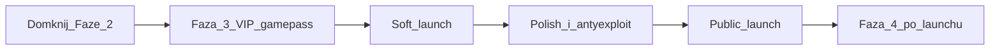

# Plan rozwoju do produkcji (bait / pets)

Żywy dokument — odhaczaj w miarę postępu. Decyzje ustalone z rekomendacji.

## Decyzje

| Temat | Wybór |
|--------|--------|
| Launch | Soft launch (znajomi / prywatne) → potem public; **bez** 2. świata przed otwarciem |
| Monetyzacja na start | Tylko **VIP gamepass** (`VipAccess`); DevProducts dopiero po 1–2 tyg. danych |

Świadomie **poza** soft/public: trade, eggs, combat, PvP, drugi świat.

---

## Stan obecny — Faza 1 + Faza 2 (kod)

- [x] Core loop: throw → luck → catch → sell → shop / upgrades
- [x] Tutorial 4 kroków, goals, inventory (lock / bulk / hotbar)
- [x] Pet Index (% + NEW)
- [x] Soft pity Epic+, daily streak
- [x] DataStore `PlayerData_v3` (wipe po economy 1D; v2 porzucone)
- [x] VIP cave infra: Normal + VIP **2×** luck, flaga `VipAccess`

---

## Faza 2 residual — domknięcie przed monetyzacją

- [x] **Studio QA VIP** — pad VIP nie na moście; CatchZone VIP radius 18; VIP luck attributes refresh on boot
  - Manual: w Studio potwierdź THROW / VIP / `/vip off`; opcjonalnie `ManualPad=true` na `ThrowPointVip` żeby zablokować auto-pozycję
- [x] Ikony petów: ViewportFrame (gdy model w `ReplicatedStorage.PetPreviews`) + rarity chip fallback
- [x] Catch celebration FX: Rare=shake; Epic+=burst; Legendary+=cinematic zoom 1–2s; dźwięki Epic/Mythic/Divine; aura w Result UI
- [x] Proste strzałki tutorialu przy podświetlonych przyciskach HUD
- [x] Roster / modele top rarities: Legendary+ aura (światło + particles + Highlight) przy equip; mocniejsza ramka + badge w UI (`PetRarityFx`)

Pliki: `CaveConfig.luau`, `BaitBootstrap.server.luau`, `PetIconUi.luau`, `TutorialClient`, `BaitClient`

---

## Faza 3 — VIP gamepass (jedyna monetyzacja soft launch)

- [x] Config `VipConfig.GamePassId` (ustaw ID z Creator Dashboard)
- [x] Serwer: `UserOwnsGamePassAsync` przy join + `PromptGamePassPurchaseFinished` → `SetVipAccess`
- [x] Klient: VIP bez passa → prompt zakupu (nie tylko toast)
- [x] Studio: bez auto-grant VIP; ownership z Game Pass; `/vip on|off` tylko do QA mapy
- [x] **Creator Dashboard:** utwórz Game Pass i wklej ID do `VipConfig.GamePassId` (`1942164267`)
- [x] Test live: brak passa → lock; zakup → VIP 2×; rejoin zachowuje dostęp
  - Prompt zakupu: `VipPurchase` (HUD VIP + throw w VIP cave); pass On Sale 99 R$

---

## Soft launch checklist (operator)

Kod soft-launch ready. Odhacz w Studio / Dashboard:

1. [x] Place prywatny / friends-only; DataStores API włączone
   - Status: Limited/Friends + Studio API ON + publish z pass ID `1942164267`
2. [x] Game Pass ID w kodzie: `1942164267` (`VipConfig`) — pass z właściwej experience
3. [ ] Smoke test 15–20 min: tutorial → catch → sell → upgrade/shop → daily → goals → Index
   - Po economy **1D**: Bronze **nie** w 15 min; upgrade 1 tak; Silver ~2–3 dni casual; checklist w `ready.md`
4. [x] VIP: zakup + gate bez passa (prompt Game Pass w grze)
5. [ ] Save: leave / rejoin (coins, pets, baits, pity, daily, VipAccess)
6. [ ] 3–5 testerów — zbierz: crash, softlock tutorial, „nudne po X min”, mobile UI

**Kryterium wyjścia:** brak blockerów + ktoś chce wrócić następnego dnia.

---

## Faza 3.5 — polish + bezpieczeństwo przed public

- [x] Antyexploit min: re-check dystansu CatchZone przy SubmitLuck; sklep/upgrade już z configu serwera + cooldown
- [x] DataStore: retry (3×) + BindToClose z timeoutem
- [x] Mobile HUD: `UiTheme.MobileScale` na HUD/modalach (TeleportHud + Shop/Upgrade/Goals/…)
- [x] Branding checklist udokumentowana w sekcji Public launch (operator — Creator Dashboard)
- [x] **UI pass:** wspólny `UiTheme` + `UiToast` (slate-teal / amber / cyan); restyl Shop/Sell/Upgrade/Throw/Index/Goals/Daily/Tutorial/Settings/Hotbar
- [x] **Economy nerf (1A):** luck bar max 8×; bait prices/mults; Common–Epic sells; soft weight 0.14; droższe early upgrades; −35% tutorial/start/daily/goals coins
- [x] **Economy hard (1B):** `NumberFormat` (K/M/B…); SoftWeight 0.09; OneIn Epic+ ↑; pity Grace 45 / cap 2.0; bait silver→fortune duże multy + ceny; sell early ↓; upgrades droższe; start/daily/goals/tutorial ↓; wipe `PlayerData_v2`
- [x] **Drop + goals harden (1C):** SoftWeight **0.24**, ExponentScale 0.45, NeutralBias Epic; VIP **2×**; pity tylko Epic–Legendary (nie Angelic+); OneIn Mythic+ ↑; goals catch 25/60/120, discover Rare/Epic/Legendary, earn 1.5K/8K/25K
- [x] **Map 1 retune (1D):** SoftWeight **0.27**, ExponentScale 0.40; VIP zostaje **4×**; Bronze **16k** (~50–75 min); Copper **55k**; Silver **165k**; Common sell **10**; Lucky Surge **1.8×**; potion **65k**; goals earn 2.5K/14K/45K
- [ ] Domknięcie residual Studio (QA VIP mapy) — operator; endgame FX w kodzie done
- [ ] Re-smoke pacing po 1D (checklist w `ready.md`: Bronze nie w 15 min; VIP+basic ≠ Glorious w 15 min)
---

## Public launch (operator)

Po przejściu soft launch checklist:

1. [ ] Place publiczny; VIP gamepass widoczny w store gry
2. [ ] Opis loopu + soft CTA do VIP
3. [ ] Branding: nazwa place, ikona, description, 1–2 thumbnails
4. [ ] Monitor 48h: error log, skargi o save, exploit reports
5. [ ] Hotfix tylko blockerów; feature freeze poza krytycznymi bugami

**Feature freeze:** zero DevProducts / 2. świata / trade do czasu stabilnych 48h.

---

## Faza 4+ — po public (kolejność)

1. DevProducts (monety / temporary luck) — jeśli VIP się sprzedaje i ekonomia nie pęka
2. Drugi świat / biom (`TeleportService` + osobna jaskinia)
3. Głębszy Pet Index (filtry, pełne ViewportFrame wszędzie)
4. Nadal unikamy: trade, eggs, combat, PvP aż core retention jest OK

---

## Notatki implementacyjne

| System | Plik / miejsce |
|--------|----------------|
| VIP pass ID | `ReplicatedStorage/Modules/VipConfig.luau` |
| VIP ownership | `ServerScriptService/BaitSystem/VipGamePassServer.server.luau` |
| VIP purchase UI | `ReplicatedStorage/Modules/VipPurchase.luau` |
| UI theme / toast | `ReplicatedStorage/Modules/UiTheme.luau`, `UiToast.luau` |
| Ikony | `ReplicatedStorage/Modules/PetIconUi.luau` |
| Endgame FX | `ReplicatedStorage/Modules/PetRarityFx.luau` (+ `PetEquipService`) |
| Pet previews | `PetCatalogService` → `ReplicatedStorage.PetPreviews` |
| Save retry | `PlayerDataService.Save` / `BindToClose` |
| Economy knobs | `LuckConfig`, `BaitConfig`, `PetConfig`, `UpgradeConfig`, `ShopConfig`, `TutorialConfig`, `DailyConfig`, `GoalConfig`, `PityConfig`, `NumberFormat` |
